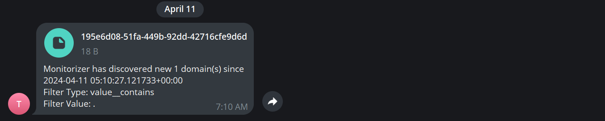

# Monitorizer
<p align="center">
    <a href="https://twitter.com/BitTheByte">
      
    </a>
    <h3 align="center">The Ultimate Subdomain Monitoring Framework</h3>
</p>

<p align="center">
    <a href="#" alt="Code Style">
        
    </a>
    <a href="#" alt="Build">
        
    </a>
    <br>
    <a href="https://github.com/bitthebyte/monitorizer/" alt="Stars">
        
    </a>
    <a href="https://github.com/bitthebyte/monitorizer/" alt="Support Python Version">
        
    </a>
    <a href="https://github.com/bitthebyte/monitorizer/pulse" alt="Activity">
        
    </a>
</p>


# Installation

| :exclamation:  **Disclaimer**                                                                                                                                           |
|-------------------------------------------------------------------------------------------------------------------------------------------------------------------------|
| **Admin users are able to execute code on the local server make sure to change the default password at otherwise use it at your own risk** |

### Using docker
```bash
$ curl https://raw.githubusercontent.com/BitTheByte/Monitorizer/main/docker-compose.yml | docker compose -f - up
```

### Default Credentials:
Once everything is ready you will be able to login to the dashboard at http://127.0.0.1:8000/dashboard/

| Username | Email                      | Password |
|----------|----------------------------|----------|
| admin    | monitorizer@bitthebyte.com | P@ssW0rd |

# Features

### Scalable 
Monitorizer fully designed to run on large scale and handle thousands of distributed operations effortlessly  

### Events
Monitorizer supports various reporting channels to ensure you're always informed.

**Telegram**: Updates and alerts are directly sent to your specified Telegram channel, allowing for instant notifications and immediate team collaboration.



**Webhook**: Receive detailed reports and alerts through your webhook server to keep you aligned.


### Extendable
Employ a zero-code strategy to integrate your own tools for domain enumeration and discovery effortlessly. Customize and extend functionalities without writing any new code.

### Advanced Search
Utilize the dashboard to conduct comprehensive searches across all Monitorizer assets. This feature allows for quick location of necessary data points, streamlined through an intuitive search interface.

### Import-Export
Utilize the dashboard to import and export assets easily