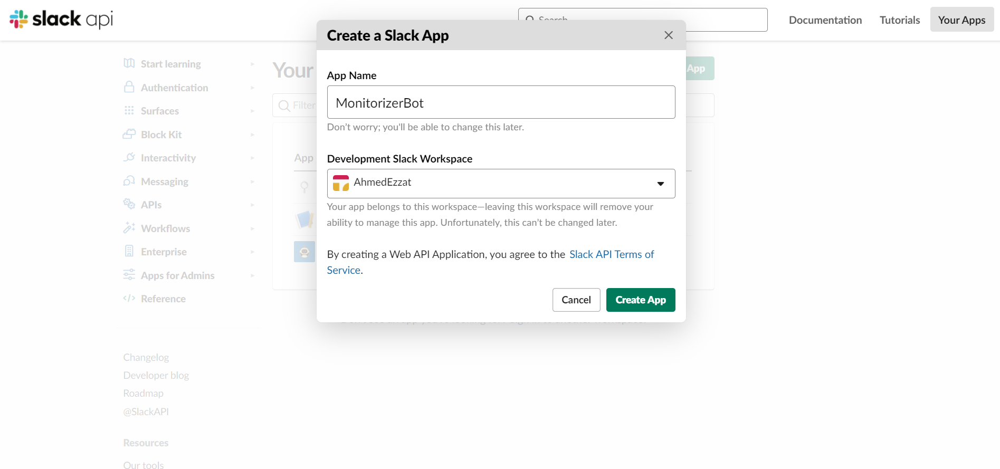
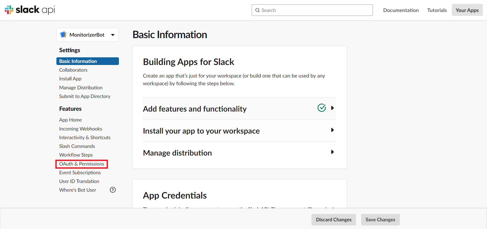
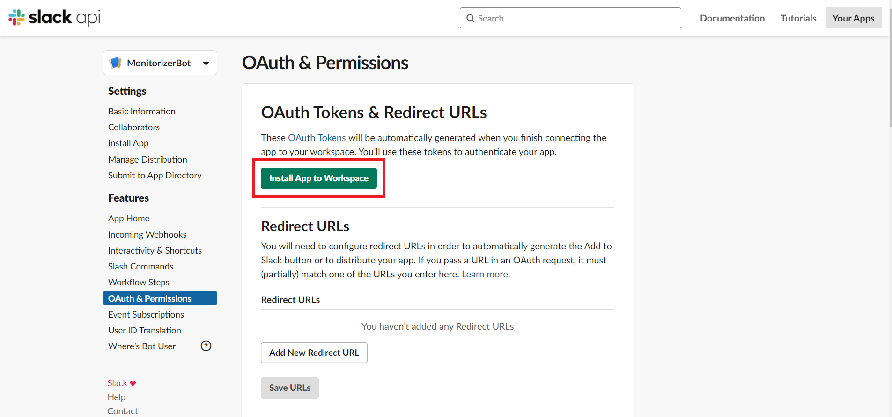
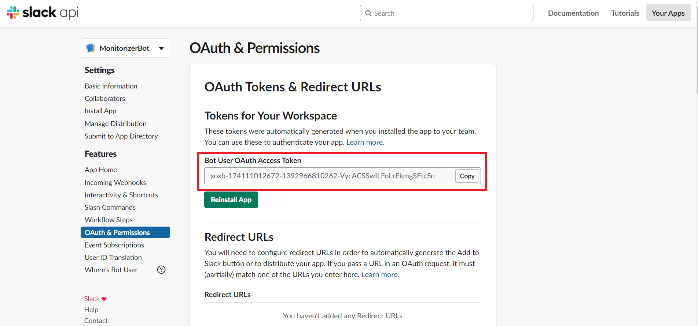
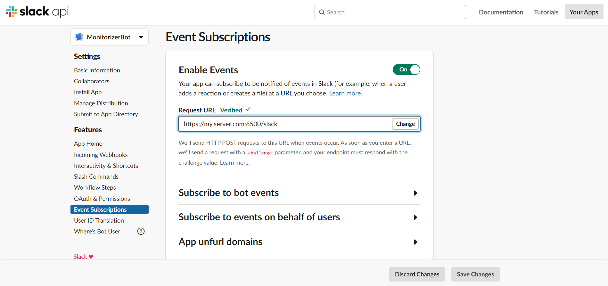

# Get started
To enable basic slack reporting you need to Go to https://api.slack.com/apps and Create new slack app



After creating the app you will be greeted with new window like this. click on `OAuth & Permissions`



At the `OAuth & Permissions` tab scroll down util you see `Scopes` tab
and set the your bot scopes as follows:

<p align="center" width="100%">
    
</p>

```
app_mentions:read
chat:write
chat:write.customize
chat:write.public
```

Scroll up and install the app to your workspace



Now the app is installed. set slack bot token on `config/default.yaml` to your token
and to set slack channel just go to your channel and look at the url `https://app.slack.com/client/IGNORE/CHANNEL_ID`



Now you will receive new discovered subdomains however to control the app using slack you have to enable app mentions

# Enable App Mentions
To enable app mentions you need to go to `Event subscribtion` tab and set `Request URL` to your server hosing the tool



And set your `bot events` as follows


```
app_mention
```

Now you're ready to go verify by mentioning the app   


